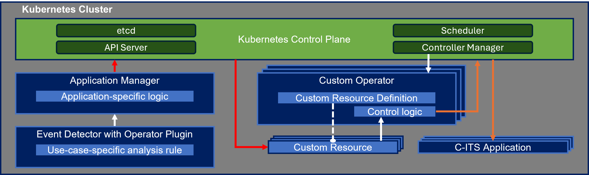

# Application Management in C-ITS: Application Manager and Custom Operators

<p align="center">
  
  
  <a href="https://github.com/ika-rwth-aachen/application_manager/actions/workflows/docker-ros.yml"></a>
  <a href="https://github.com/ika-rwth-aachen/application_manager/actions/workflows/custom-operators.yml"></a>
  
  <a href="https://github.com/ika-rwth-aachen/application_manager"></a>
</p>

<p align="center">
⸻ <b><i><a href="#quick-start">Quick Start</a></i></b> | <b><i><a href="#installation">Installation</a></i></b> | <b><i><a href="#documentation">Documentation</a></i></b> | <b><i><a href="#research-paper">Research Paper</a></i></b> | <b><i><a href="#acknowledgements">Acknowledgements</a></i></b> ⸻
</p>

With this repository, we provide a reference implementation of our application management framework which is conceptualized in our [research paper](#research-paper). The framework consists of the components *application manager* and the *custom operators*. It enables the demand-driven deployment, reconfiguration, and shutdown of applications in a Kubernetes cluster.

The repository contains the following components:
- **Application Manager**: The application manager is a ROS 2 node implemented in the [*application_manager*](./application_manager/) package. It acts as a ROS 2 action server and listens for incoming requests (`DeploymentRequests`) to deploy, reconfigure, or shutdown applications.
- **Application Manager Interfaces**: The [*application_manager_interfaces*](./application_manager_interfaces/) package contains the ROS 2 action and message definitions containing the `DeploymentRequest` which is interpreted by the application manager.
- **Custom Operators**: The code for the implemented [*Kopf*](https://kopf.readthedocs.io/en/latest/) operators together with the Kubernetes custom resource definitions (CRDs) is located in the [*custom-operators*](./custom-operators/) folder.

The reference implementation in this repository contains the *Object Detection Fusion* application enabling collective environment perception. This application is applied in the experiment described in our [research paper](#research-paper). The logic is extensible for new applications.

<p align="center">
  
</p>

The image above illustrates the architecture of the application management framework. The application manager and the custom operators are brought into action in the use case ["Collective Perception at Intersection"](https://github.com/ika-rwth-aachen/robotkube/tree/main/use-cases/collective-perception-intersection) in the scope of [*RobotKube*](https://github.com/ika-rwth-aachen/robotkube). We invite you to check out the code and run the use case.


> [!IMPORTANT]  
> This repository is open-sourced and maintained by the [**Institute for Automotive Engineering (ika) at RWTH Aachen University**](https://www.ika.rwth-aachen.de/).  
> **Advanced C-ITS Use Cases** are one of many research topics within our [*Vehicle Intelligence & Automated Driving*](https://www.ika.rwth-aachen.de/en/competences/fields-of-research/vehicle-intelligence-automated-driving.html) domain.  
> If you would like to learn more about how we can support your advanced driver assistance and automated driving efforts, feel free to reach out to us!  
> :email: ***opensource@ika.rwth-aachen.de***

## Quick Start
Consider our [example](./example/) and see how to run the application manager in a Docker container orchestrating Kubernetes resources in a local Kubernetes cluster based on *k3d*.

### RobotKube
Check out the [repository RobotKube](https://github.com/ika-rwth-aachen/robotkube) containing executable use cases to see the application management framework in action. 

Especially the use case ["Collective Perception at Intersection"](https://github.com/ika-rwth-aachen/robotkube/tree/main/use-cases/collective-perception-intersection) gives a good idea of the capabilities of the application manager and the custom operators.
In the [repository](https://github.com/ika-rwth-aachen/robotkube), for each use case, you find a guide on how to run the use case in a local Kubernetes cluster. See for example [here](https://github.com/ika-rwth-aachen/robotkube/tree/main/use-cases/collective-perception-intersection#usage).

## Installation

You can integrate the *application_manager* package stack into your existing ROS 2 workspace by cloning the repository, installing all dependencies using [*rosdep*](http://wiki.ros.org/rosdep), and then building it from source.

```bash
# ROS workspace$
git clone https://github.com/ika-rwth-aachen/application_manager.git src
rosdep install -r --ignore-src --from-paths src
colcon build --packages-up-to application_manager --cmake-args -DCMAKE_BUILD_TYPE=Release
pip install kubernetes
```

### docker-ros

The *application_manager* package stack is also available as a Docker image, containerized through [*docker-ros*](https://github.com/ika-rwth-aachen/docker-ros). Note that launching the container launches the `application_manager` node by default (`ros2 launch application_manager application_manager.launch.py`).

```bash
docker run --rm ghcr.io/ika-rwth-aachen/application_manager:latest
```

## Documentation

### How to add support for a new application

<details><summary><i>Click to show</i></summary>

The reference implementation of the application management framework in this repository is extensible for new applications. Depending on your use case, you can extend the application manager and/or implement new custom operators to support your application or to support another type of [*connection*](./application_manager/application_manager/connections/). An examplary application that we provide with the reference implementation is the [*Object Detection Fusion Application*](./application_manager/application_manager/applications/object_detection_fusion_app.py). In the example, the *Object Detection Fusion Application* involves services for *object detection*, *object fusion* and *MQTT clients* for data transmission. Therefore, so far, we implemented three custom opertors which operate the custom resources of those services.

Consider the following steps to add support for a new application:
1. In the [*application_manager*](./application_manager/) package, create a new class in a new Python file located in the [`applications`](./application_manager/application_manager/applications/) folder. There, you can implement application-specific configuration that is, e.g., interpreted from an incoming `DeploymentRequest`. As an example, see the [*Object Detection Fusion Application*](./application_manager/application_manager/applications/object_detection_fusion_app.py). Include the new class in the [main file](./application_manager/application_manager/application_manager.py). See, for example, [here](./application_manager/application_manager/application_manager.py#L14). Your implemented class should at least include a constructor (see, e.g., [here](./application_manager/application_manager/applications/object_detection_fusion_app.py#L9)) and a method generating the Kubernetes custom resource (see, e.g., [`generate_custom_resources()`](./application_manager/application_manager/applications/object_detection_fusion_app.py#L126)).
1. In the [main file](./application_manager/application_manager/application_manager.py), in the method[`configure_custom_resource_deployments_applications()`](./application_manager/application_manager/application_manager.py#L207), add code (e.g., [here](./application_manager/application_manager/application_manager.py#L236)) for your new application where you initialize the new class you implemented in the previous step and call the method `generate_custom_resources()` of your new class. This method generates the Kubernetes custom resource for your application which is subsequently deployed by the application manager (see [here](./application_manager/application_manager/application_manager.py#L195)).
1. When you implement a new application for which you need one or more new Kubernetes Custom Resource Definitions (CRDs), you need to implement new custom operators (one per new CRD) which operate the CRDs. Add the code for your new custom operators in the [`custom-operators`](./custom-operators/) folder. Consider the following steps:
    1. Add one new Custom Resource Definition (CRD) (see, e.g., [here](./custom-operators/object-fusion/custom-resource-definition/object_fusion_crd.yml)) per implemented operator.
    1. According to the control logic to operate the custom resource (see, e.g., [here](./custom-operators/object-fusion/operator/object_fusion_operator.py)), implement and add the code of your new operator in the [`custom-operators`](./custom-operators/) folder including a configuration file with which the user can provide parameters (see, e.g., [here](./custom-operators/object-fusion/operator/config.yml)).
    1. Create a Dockerfile (see, e.g., [here](./custom-operators/object-fusion/Dockerfile)) based on which the Docker image of your operator is built via a [GitHub workflow](./.github/workflows/custom-operators.yml). The Docker image is then pushed to the [GitHub Container Registry](https://github.com/orgs/ika-rwth-aachen/packages?repo_name=application_manager).
1. Extend the ROS 2 message definition in the [*application_manager_interfaces*](./application_manager_interfaces/) package with your new application, especially [here](./application_manager_interfaces/msg/Application.msg). Consider what information is needed and should be encoded in the `DeploymentRequest` to deploy your new application.

</details>

## Research Paper

We hope our paper, data and code can help in your research. If this is the case, please cite our paper and give this repository a star ⭐.

<details>
<summary>BibTeX</summary>

```
@INPROCEEDINGS{Zanger2025ApplicationManagementinCITS,
  author={Zanger, Lukas and Lampe, Bastian and Reiher, Lennart and Eckstein, Lutz},
  booktitle={2025 IEEE 28th International Conference on Intelligent Transportation Systems (ITSC)}, 
  title={Application Management in C-ITS: Orchestrating Demand-Driven Deployments and Reconfigurations}, 
  year={2025},
  pages={241-247},
  doi={10.1109/ITSC60802.2025.11423445}}
```
</details>

> **Application Management in C-ITS: Orchestrating Demand-Driven Deployments and Reconfigurations** ([IEEE Xplore](https://ieeexplore.ieee.org/document/11423445), [arXiv](https://arxiv.org/abs/2509.18793))
>
> [Lukas Zanger](https://www.ika.rwth-aachen.de/de/institut/team/fahrzeugintelligenz-automatisiertes-fahren/zanger.html), [Bastian Lampe](https://www.ika.rwth-aachen.de/de/institut/team/fahrzeugintelligenz-automatisiertes-fahren/lampe.html), [Lennart Reiher](https://www.ika.rwth-aachen.de/de/institut/team/fahrzeugintelligenz-automatisiertes-fahren/reiher.html), and [Lutz Eckstein](https://www.ika.rwth-aachen.de/de/institut/team/univ-prof-dr-ing-lutz-eckstein.html)
>
> [Institute for Automotive Engineering (ika), RWTH Aachen University](https://www.ika.rwth-aachen.de/en/)
>
> <sup>*Abstract* – Vehicles are becoming increasingly automated and interconnected, enabling the formation of cooperative intelligent transport systems (C-ITS) and the use of offboard services. As a result, cloud-native techniques, such as microservices and container orchestration, play an increasingly important role in their operation. However, orchestrating applications in a large-scale C-ITS poses unique challenges due to the dynamic nature of the environment and the need for efficient resource utilization. In this paper, we present a demand-driven application management approach that leverages cloud-native techniques – specifically Kubernetes – to address these challenges. Taking into account the demands originating from different entities within the C-ITS, the approach enables the automation of processes, such as deployment, reconfiguration, update, upgrade, and scaling of microservices. Executing these processes on demand can, for example, reduce computing resource consumption and network traffic. A demand may include a request for provisioning an external supporting service, such as a collective environment model. The approach handles changing and new demands by dynamically reconciling them through our proposed application management framework built on Kubernetes and the Robot Operating System (ROS 2). We demonstrate the operation of our framework in the C-ITS use case of collective environment perception and make the source code of the prototypical framework publicly available at [github.com/ika-rwth-aachen/application_manager](https://github.com/ika-rwth-aachen/application_manager).</sup>


## Acknowledgements

This work is accomplished within the projects *autotech.agil* (FKZ 01IS22088A) and *6GEM* (FKZ 16KISK036K). We acknowledge the financial support for the projects by the *Federal Ministry of Education and Research of Germany (BMBF)*.